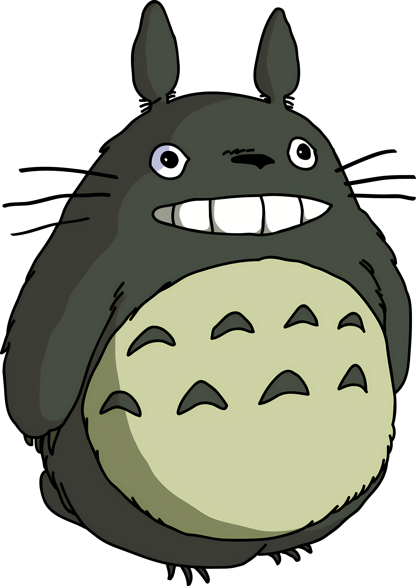

<p align="center">
  <kbd>
    
  </kbd>
</p>

<h1 align="center">
  <samp>leutenantKiya</samp>
</h1>

<p align="center">
  <samp>telegram bot maker · automation wanderer · tiny tool gardener</samp>
</p>

<p align="center">
  
</p>

<p align="center">
  
  <a href="https://github.com/leutenantKiya?tab=followers">
    
  </a>
  <a href="https://github.com/leutenantKiya?tab=repositories">
    
  </a>
</p>

<p align="center">
  
  
  
  
</p>

---

<table>
  <tr>
    <td width="64%" valign="top">
      <h3><samp>sunny field log</samp></h3>
      <p>
        Hi, I’m <b>Kiya</b>. I build Telegram bots, simple automations, and small developer tools with a calm, storybook-like feeling.
      </p>
      <p>
        I like projects that are easy to enter, pleasant to maintain, and useful enough to become part of someone’s everyday workflow.
      </p>
      <ul>
        <li><b>Craft:</b> friendly bot flows and practical automation</li>
        <li><b>Style:</b> clean structure, soft UI details, readable logic</li>
        <li><b>Direction:</b> turning repeated tasks into quiet helpers</li>
        <li><b>Mood:</b> clear weather, warm tea, green builds</li>
      </ul>
    </td>
    <td width="36%" align="center" valign="top">
      <kbd>
        
      </kbd>
      <br />
      <sub><b>Kiya’s forest mascot</b></sub>
      <br />
      <sub><samp>debug guardian · snack inspector · commit watcher</samp></sub>
    </td>
  </tr>
</table>

<h2 align="center"><samp>current quest board</samp></h2>

```yaml
profile:
  handle: "leutenantKiya"
  basecamp: "a small coding camp beside a quiet lake"
  headquarter : Jogja

building:
  - "Telegram bot experiences"
  - "automation scripts that save time"
  - "small utilities with clean behavior"

learning:
  - "backend patterns that stay maintainable"
  - "better conversational UX"
  - "developer workflows that feel effortless"
  - "Become The AI before AI becomes me"

principles:
  - "make the happy path obvious"
  - "keep the code readable after sunset"
  - "ship useful things, then polish the edges"
```

<h2 align="center"><samp>travel bag</samp></h2>

<p align="center">
  
</p>

<p align="center">
  
  
  
  
</p>

<table>
  <tr>
    <td width="33%" align="center">
      <h3><samp>build</samp></h3>
      <p>Bot commands, automation flows, and practical backend helpers.</p>
    </td>
    <td width="33%" align="center">
      <h3><samp>polish</samp></h3>
      <p>Readable docs, friendly messages, and small interface details.</p>
    </td>
    <td width="33%" align="center">
      <h3><samp>learn</samp></h3>
      <p>Patterns, tooling, and workflows that make projects easier to grow.</p>
    </td>
  </tr>
</table>

<h2 align="center"><samp>garden stats</samp></h2>

<div align="center">
  
  
</div>

<div align="center">
  
</div>

<div align="center">
  
</div>

<h2 align="center"><samp>tiny postcards</samp></h2>

<table>
  <tr>
    <td width="50%" valign="top">
      <h3 align="center"><samp>bot crafting</samp></h3>
      <p align="center">
        I enjoy creating bots that feel responsive, clear, and genuinely helpful instead of noisy.
      </p>
    </td>
    <td width="50%" valign="top">
      <h3 align="center"><samp>quiet automation</samp></h3>
      <p align="center">
        I like turning repeated tasks into tiny background helpers that make the day smoother.
      </p>
    </td>
  </tr>
  <tr>
    <td width="50%" valign="top">
      <h3 align="center"><samp>clean paths</samp></h3>
      <p align="center">
        Code should feel like a marked trail: easy to follow, easy to return to, and safe to extend.
      </p>
    </td>
    <td width="50%" valign="top">
      <h3 align="center"><samp>soft details</samp></h3>
      <p align="center">
        Small touches matter: friendly wording, smooth commands, and thoughtful defaults.
      </p>
    </td>
  </tr>
</table>

<h2 align="center"><samp>find me around GitHub</samp></h2>

<p align="center">
  <a href="https://github.com/leutenantKiya">
    
  </a>
  <a href="https://github.com/leutenantKiya?tab=repositories">
    
  </a>
</p>

---

<p align="center">
  <samp>Thanks for visiting. May your bugs be tiny, your logs be readable, and your builds stay green.</samp>
</p>

<p align="center">
  
</p>
